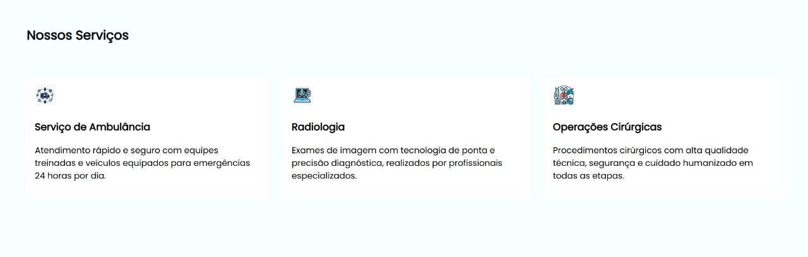
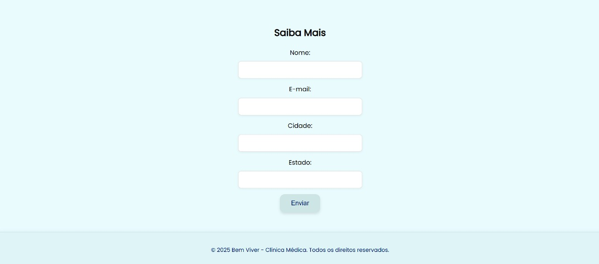

# 🏥 Bem Viver - Clínica Médica

**Bem Viver** é um projeto de página web para uma clínica médica, desenvolvido com foco em acessibilidade, responsividade e design moderno. O site apresenta informações sobre a clínica, especialidades médicas, formulário de contato e outros serviços.

## 🔍 Visão Geral

O projeto é composto por:

- Página principal com seções informativas
- Formulário de contato com campos estilizados
- Ícones representando especialidades médicas
- Design harmonioso com cores suaves
- Navegação suave entre seções da página

## 🚀 Tecnologias Utilizadas

- HTML5
- CSS3
- Google Fonts

## 📸 Captura de Tela

 
 
 
 

## 🧩 Funcionalidades

- ✅ Campos de formulário estilizados e acessíveis
- ✅ Botões com efeito de sombra e cor suave
- ✅ Ícones ilustrativos para cada especialidade
- ✅ Navegação entre seções via âncoras

## 📂 Estrutura do Projeto

├── index.html ├── style.css ├── imagens/ │ └── ícones/ └── README.md

## 📎 Como Usar

1. Clone o repositório:
```bash
git clone https://github.com/seu-usuario/nome-do-repo.git
Abra o index.html em seu navegador.

Pronto! Explore o site e edite conforme necessário.
